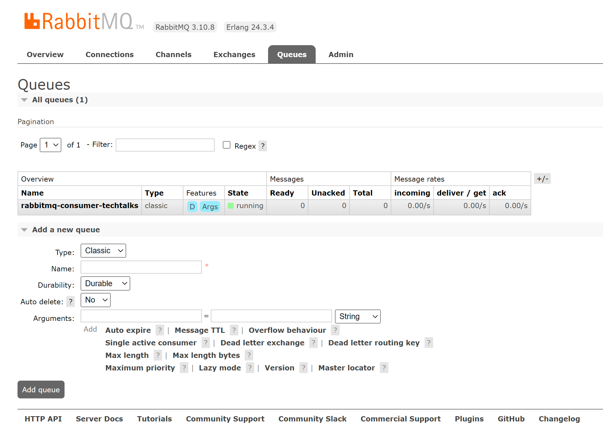

# Configure RabbitMQ queue and Exchange

In this section we will configure the RabbitMQ queue and exchange. We will create a queue named `rabbitmq-consumer-techtalks` and a exchange named `techtalks` of the type `fanout`. The producer will publish messages to the exchange.

## Login to the RabbitMQ Management Console

The RabbitMQ Management Console is a web-based user interface for managing RabbitMQ servers. We will use the RabbitMQ Management Console to create the queue and exchange.

Navigate to the public IP address of the RabbitMQ cluster and `15672` port. For example, `http://20.24.98.54:15672`

Provide the credentials for the RabbitMQ cluster. The username is `user` and the password is `tCUN6UizuwTZ`. If you are using your own RabbitMQ cluster, update the credentials accordingly.

## Create an Exchange

We will create an exchange named `techtalks` of the type `fanout`. The producer will publish messages to the exchange. Since we are using Dapr pubsub component, we need to follow some conventions. The topic name maps to the exchange name or rather a topic in Dapr terminology is an exchange in RabbitMQ.

Ensure the techtalks exchange has following properties:

- Name: `techtalks`
- Type: `fanout`
- Durablility: `Durable`

## Create a Queue

We will create a queue named `rabbitmq-consumer-techtalks`. The consumer will consume messages from the queue. Since we are using Dapr pubsub component, we need to follow some conventions. The queue name maps the consumer application name followed by the topic name.

When running an application with app-id as `rabbitmq-consumer` with RabbitMQ subscription, a queue is created with a prepended appid (e.g. {appid}-{queueName}).

Using this convention, the queue name will be `rabbitmq-consumer-techtalks`. Make the queue durable so that the messages are not lost when the consumer is not running.

Ensure the rabbitmq-consumer-techtalks queue has following properties:

- Name: `rabbitmq-consumer-techtalks`
- Durablility: `Durable`
- Auto-delete: `No`
- Type: `Classic`

## Bind the Queue to the Exchange

We will bind the queue to the exchange. This will ensure that the messages published to the exchange will be routed to the queue.

Navigate back to the Exchanges page and click on the `techtalks` exchange. Click on the `Bindings` tab and click on the `Add a binding` button. Provide the name of the queue as `rabbitmq-consumer-techtalks` and click on the `Bind` button. This will bind the queue to the exchange.

In the screenshot below, we can see that the queue `rabbitmq-consumer-techtalks` is already bound to the exchange `techtalks`.

